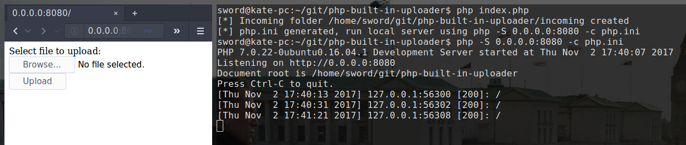

# Built-in uploader



Serve an upload form using PHP's built-in web server. Useful when you need a quick way to upload files to another device.

## Features
- Everything you need in one PHP file
- Set your own limits (Memory/Max file size)
- Protected against path traversal attacks using basename and an absolute path to define the location of the uploaded file

## Usage
```
php index.php # generated php.ini
php -s 0.0.0.0:8080 -c php.ini # serve upload form
```
## Note
PHP's built-in web server should not be used on a public network, also see: http://php.net/manual/en/features.commandline.webserver.php
